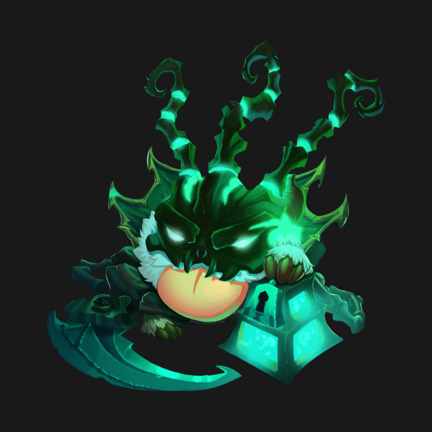

[](https://godoc.org/github.com/arxdsilva/thresh)
[](https://travis-ci.org/arxdsilva/thresh)
[](https://coveralls.io/github/arxdsilva/thresh?branch=master)
[](https://goreportcard.com/report/github.com/arxdsilva/thresh)
[](LICENSE)

# Thresh


Library that allows you to use a healthcheck route as a checker for other routes/APIs. This was made to keep checking the size of a channel that is returned in a route, but it's open enought to serve your own porpuse.

# [Example](https://github.com/arxdsilva/thresh/tree/master/example)

This is a simple example of a implementation in a handler, you can find the full source code [here](https://github.com/arxdsilva/thresh/tree/master/example).

```golang

type SomeStruct struct {
	Value int
}

func HealthCheck(c echo.Context) (err error) {
	go func() {
		addrs, err := thresh.Addrs()
		if err != nil {
			// log err somewhere
		}
		for _, ad := range addrs {
			p := new(thresh.Ping)
			p.Addr = ad
			// pass some structure
			str := new(SomeStruct)
			err = p.StartAddr(str)
			if err != nil {
				// log err somewhere
			}
			// create a checker function
			// to your structure
			CheckFields(str, p)
			// [WIP] this will warn 
			// your slack channel
			p.CheckStatus()
		}
	}()
	return c.String(http.StatusOK, "OK")
}

func CheckFields(s *SomeStruct, p *thresh.Ping) {
	if s.Value > 100 {
		p.Status = true
	}
}

```